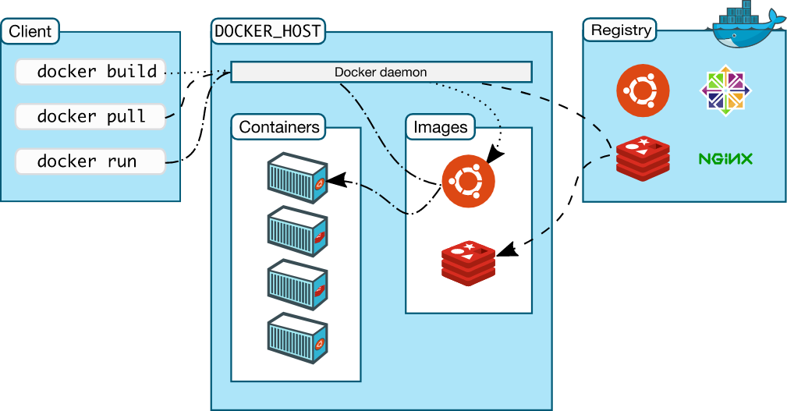
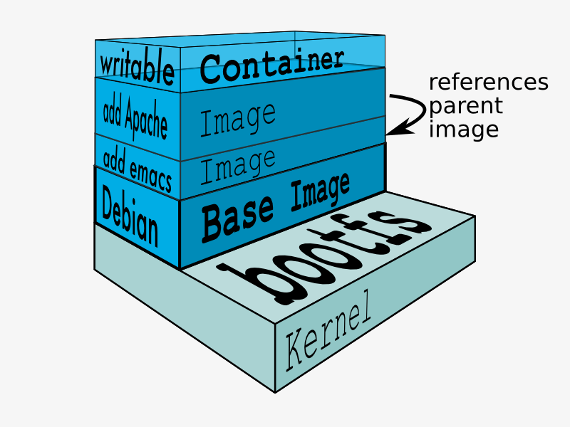

**Docker** - это инфраструктура для автоматизации развёртывания и управления приложениями в средах с поддержкой контейнеризации.

## Что такое контейнеризация?

**Эмуляция** - технология "имитирования" процессора, т.е. исполнения команд процессора одной архитектуры, на процессоре другой архитектуры.
**Виртуализация** - технология отделения среды исполнения программы или ОС от работающей ОС.
**Контейнеризация** - метод виртуализации на уровне ядра ОС (с общим ядром).

###### Вопросы
 - Можно ли запустить контейнер с Linux на Windows хосте?
 - А наоборот?

## Какие преимущества нам дает контейнеризация?

- Контейнеризация**обеспечивает надежную изоляцию процессов и повышает уровень безопасности систем**. Приложения, которые работают внутри контейнера, не имеют доступа к основной ОС и не могут на неё влиять.
- Сохранение чистоты ОС хоста.
- Благодаря контейнерам мы можем развертывать приложение на разных хостах.
- Стандартизация развертывания приложений.
- "Магазин" приложений.
- Автоматизация развертывания приложений.
- Масштабирование, автоскейлинг, повышеная надежность и др.

###### Немного про социализацию
https://hub.docker.com/
https://artifacthub.io/

## Какие были проблемы?
Часто преминение контейнеризации для решение "новой" задачи приводило к выявлению недостатков реализации. Но со временем, технологию "вылизали", сделав ее ванильной и простой в использовании. Большую роль сыграло в этом всё сообщество, создавая целую инфраструктуру вокруг Docker.

## Что внутри?
В 2008 году механизм cgroups был официально добавлен в ядро Linux (версия 2.6.24).
Версия cgroups v2 была добавлена в ядро Linux 4.5.
Docker до версии 0.9 для создания контейнеров использовал проект Linux Containers (LXC).
Сейчас в Docker используется libcontainer как часть runC.  Инструмент runC является результатом попытки создать единый стандарт в области контейнерных технологий. Написан на GoLang.

### Windows или Linux?
Механизмы cgroups, LXC, etc изначально возникли внутри Linux ОС и к Windows не имели отношения. Однако с встраиванием в desktop Windows движка виртуализации Hyper-V изменило положение дел. Теперь мы на обычном ПК с Windows ОС можем легко запустить виртуальную машину с Linux ОС, подняв там Docker.
В 2020г Microsoft выпустил обновление, интегрировав в Windows тезнологию WSL2. А именно запуск через Hyper-V **кастомного** ядра Linux.
https://github.com/microsoft/WSL2-Linux-Kernel
Теперь на Windows ОС можно легко установить версию Docker Desktop, заточенную под использование WSL2/Hyper-v бекенда.

###### Установка под Windows:
https://desktop.docker.com/win/main/amd64/Docker%20Desktop%20Installer.exe?utm_source=docker&utm_medium=webreferral&utm_campaign=dd-smartbutton&utm_location=module
###### Установка под Linux:
``` bash
curl -fsSL https://get.docker.com -o get-docker.sh
sh get-docker.sh
```

## Как это выглядит?


## Какие объекты и понятия использует Docker?
- Container - конкретный инстанс, экземпляр приложения
- Image - "золотой образ" нашего приложения, готовый к запуску
- Registry - хранилище образов
- Image layer -  слой, часть  "золотого образа". "Слоеный" подход к созданию образов дает ряд преимуществ

###### Установка утилиты Dive
``` bash
wget https://github.com/wagoodman/dive/releases/download/v0.9.2/dive_0.9.2_linux_amd64.deb
sudo apt install ./dive_0.9.2_linux_amd64.deb
```

## Image layer


## Базовые команды Docker
``` docker
docker image ls # Просмотреть список образов на моей машине
docker image pull IMAGE/NAME:TAG # Получить образ IMAGE/NAME версии TAG из реджистри
docker build -t TAG -f /path/to/Dockerfile . # Собрать образ из Dockerfile

docker run --rm -ti IMAGE/NAME command # Запуск контейнера из образа
docker exec -ti CONTAINER_NAME command # Запуск команды внутри работающего контейнера
docker ps -a # Просмотр списка контейнеров
docker stop CONTAINER_NAME
docker start CONTAINER_NAME
docker rm CONTAINER_NAME # Управление контейнерами

# Запуск контейнера с примонтированым volume в режиме демона
docker run --rm -d -p 80:80 --mount type=bind,source="$(pwd)",target=/app --name CONTAINER_NAME IMAGE/NAME
# Пример просмотра списка контейнеров с фильтрацией по используемым портам и кастомным форматом вывода
docker ps --format '{{ .ID }}\t{{ .Image }}\t{{ .Status }}' -f publish=80
# Выполнеение команды в запущенном контейнере
docker exec -ti CONTAINER_NAME command args
# Просмотр логов контейнера
docker logs -f CONTAINER_NAME
```

## Задача
Написать Dockerfile для деплоя сайта (простого статического кнотента) и веб-сервера nginx.

### Пример Dockerfile
``` Dockerfile
FROM nginx

ARG host=localhost
ARG port=80

RUN echo ">>>>>>>>>>>>>>>>>>>>> Hello World!"

RUN apt-get update && \
    apt-get install -y \
        curl \
        wget \
        mc

COPY web/ /usr/share/nginx/html/

ENV NGINX_HOST=$host
ENV NGINX_PORT=$port

VOLUME /app

EXPOSE 80 443
```

## Что такое volume?
**Volumes** это механизм работы с персистентными данными в Docker.
По сути Volumes это механизм монтирования каталогов хостовой ОС внутрь контейнера.
См. документацию
https://docs.docker.com/storage/volumes/

## Базовые команды docker-compose
``` docker-compose
# Единоразовый запуск сервиса, описанного в docker-compose
docker compose -f /path/to/docker-compose.yml run --service-ports SERVICE_NAME command args
# Запуск сервисов в режиме демона
docker compose -f /path/to/docker-compose.yml up -d --rm SERVICE_NAME
# Остановить сервисы и удалить артефакты
docker compose -f /path/to/docker-compose.yml down
```

#### Мааленький нюанс
`docker compose run` по умолчанию не прокидывает порты, обозначеные в описании сервиса. Для открытия портов используем в cli либо `--service-ports` либо `--publish 8080:80 -p 2022:22 -p 127.0.0.1:2021:21`

## Пример docker-compose
``` docker-compose
version: "3.9"

services:
  balancer:
    image: nginx
    restart: always
    volumes:
      - ./static/:/usr/share/nginx/html/
      - ./private/:/etc/nginx/ssl/
      - ./nginx/:/etc/nginx/  
    depends_on:
      - app
    ports:
      - 80:80
      - 443:443
    networks:
      app:
        ipv4_address: 172.16.238.10
    logging:
      driver: syslog
      options:
        syslog-address: "tcp://192.168.0.42:123"

  app:  
    build: .
    restart: always
    volumes:
      - ./:/app/
    ports:
      - 9000:9000
    depends_on:
      - db
    environment:
      DATABASE_URL: postgres://db@postgres/app_db
    networks:
      app:
    logging:
      driver: syslog
      options:
        syslog-address: "tcp://192.168.0.42:123"
      
  db:
    image: postgres:9.6.2-alpine
    restart: always
    environment:
      POSTGRES_USER: ${DB_USER:-'postgresql'}
      POSTGRES_DB: ${DB_DATABASE:-'app_db'}
    networks:
      app:
    logging:
      driver: syslog
      options:
        syslog-address: "tcp://192.168.0.42:123"

networks:
  app:
    ipam:
      driver: default
      config:
        - subnet: "172.16.238.0/24"

```


## Задача
На основе превиденного выше примера и документации написать docker-compose.yml для деплоя сайта (простого статического контента) через nginx.